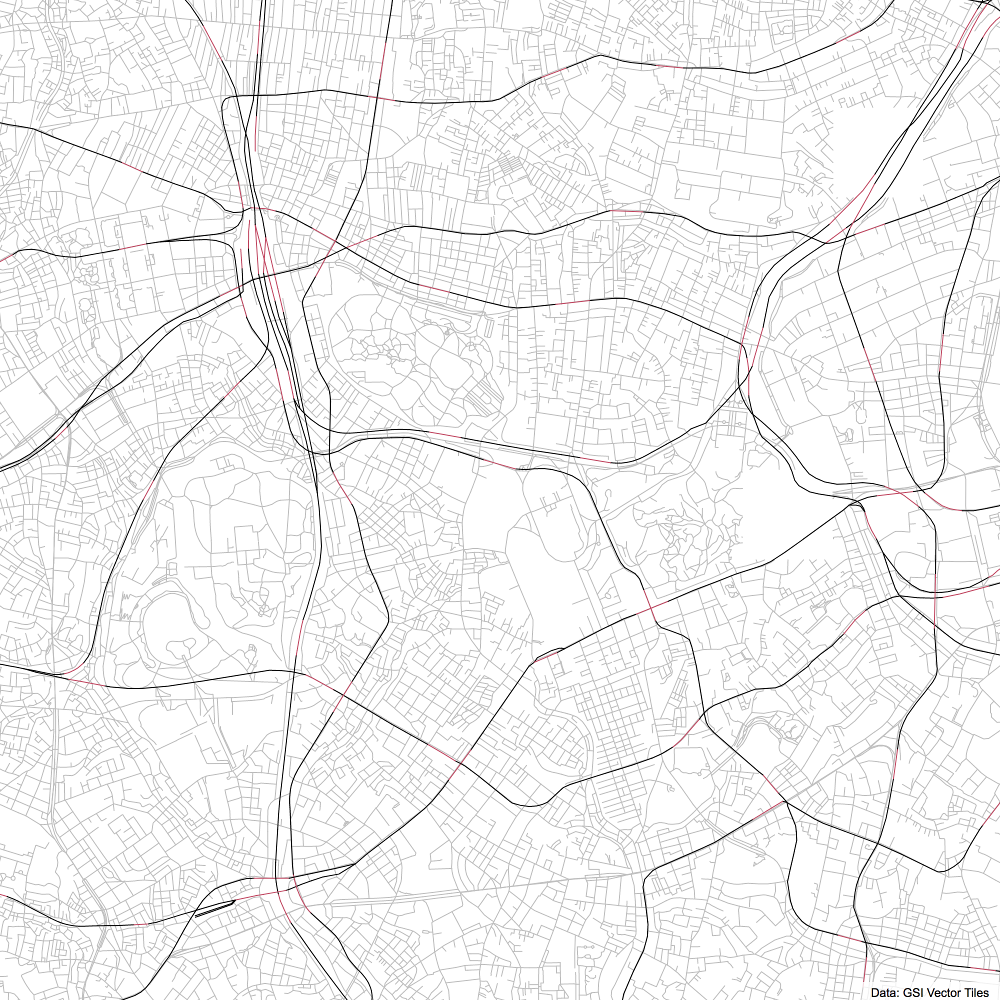
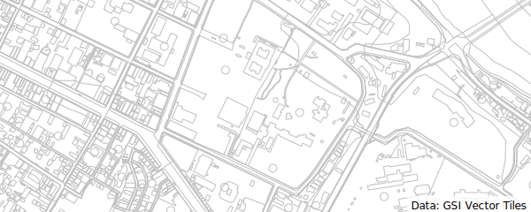

# vt2svg

## via Command Line

```Shell
$ npm install -g vt2svg
```
```Shell
$ vt2svg -w 400 -h 400 --lon 139.7149 --lat 35.6781 -z 14 --make-png -o output.svg
```

## Command Line Reference

### **vt2svg** [*options...*]

#### Map Size

Specify map size.

vt2svg **-w** [*value*]  
vt2svg **--width** [*value*]

vt2svg **-h** [*value*]  
vt2svg **--height** [*value*]

#### Map View

Specify the center coordinates of a map.

vt2svg **-x** [*value*]  
vt2svg **--lon** [*value*]

vt2svg **-y** [*value*]  
vt2svg **--lat** [*value*]

vt2svg **-z** [*value*]  
vt2svg **--zoom** [*value*]

#### Layers & Styles

vt2svg **-l** [*layer1,layer2,...*]  
vt2svg **--layers** [*layer1,layer2,...*]

vt2svg **--background** [*backgroundColor*]

#### Files

vt2svg **-o** [*filename*]  
vt2svg **--output** [*filename*]

vt2svg **--make-png**

## Samples



```Shell
$ vt2svg -w 1000 -h 1000 --lon 139.7149 --lat 35.6781
 -z 14.5 --make-png -o ./samples/gaien.svg
```



```Shell
$ vt2svg -w 600 -h 240 --lon 140.475987 --lat 36.375470 -z 16 -l fgd -o ./samples/mito.svg
```
